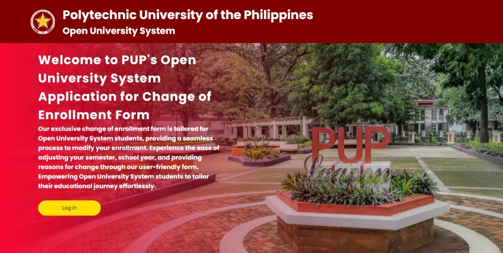
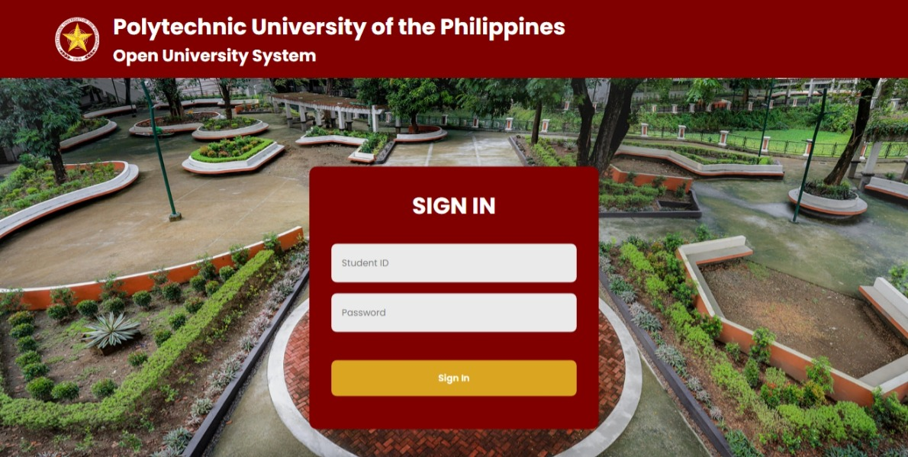
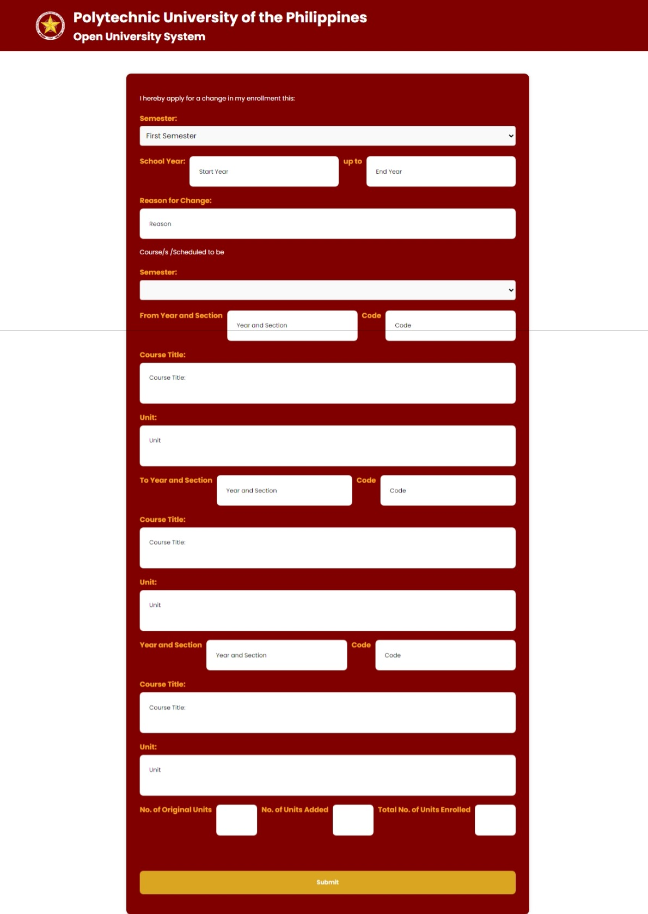

  <h3 align="center">Open University System ACE Form</h3>

## Table Of Contents

* [About the Project](#about-the-project)
  * [Screenshots](#screenshots)
  * [Tools and Technologies](#tools-and-technologies)
* [Roadmap](#roadmap)
* [Contributing](#contributing)
* [License](#license)
* [Authors](#authors)

# About the Website
Our website is dedicated exclusively to Polytechnic University of the Philippines (PUP) Open University System students, providing a seamless platform for enrollment changes. Tailored with a user-friendly interface specifically for PUP Open University students, navigating through enrollment modifications becomes effortless and straightforward. Whether it's adding or dropping courses, updating personal details, or adjusting schedules, our platform covers a wide range of needs, all within the convenience of our dedicated website. Our goal is to simplify the enrollment change process, saving valuable time and effort for PUP Open University System students.
## Screenshots

Here are some screenshots for our website.

<table>

        <td>
            
             
            
Homepage
</td>
        <td>
            
             
            
Login Page
</td>
    </tr>
    <tr>
        <td>
            
             
            
Applicant Info Page
</td>
        
    </tr>    
</table> 

(<a href="#top">back to top</a>)

## Tools and Technologies
The following tools and technologies were involved in the making of this project:

* **HTML** (HyperText Markup Language) - Standard markup language for creating static web pages.
* **CSS** (Cascading Style Sheets) - Styling language for designing and controlling the presentation of web pages.
* **JavaScript** - High-level programming language for creating functions that HTML can not do.
* **Google Sheets API** - Google Sheets API is used to integrate in our form to store all the data that being inputed in our page.
* **App Script** - Google Apps Script is a cloud-based scripting language that have been used as JavaScript for the Google Sheets.
* **[Visual Studio Code](https://code.visualstudio.com/)** - Text editor utilized to create and manage code efficiently, enhancing productivity and collaboration.

## Challenges
Here are some of the challenges we faced while developing the website:

* Other projects and deadlines that are needed to meet.
* Learning Curve for JavaScript.
* Integration of Google Sheets API to the website.
* Using Google App Script to integrate in our login page.

# Authors

* **Harley Ronquillo** - Front End
* **Brian Adem** - Back End
* **Carlos Llanes** - Documents

(<a href="#top">back to top</a>)

